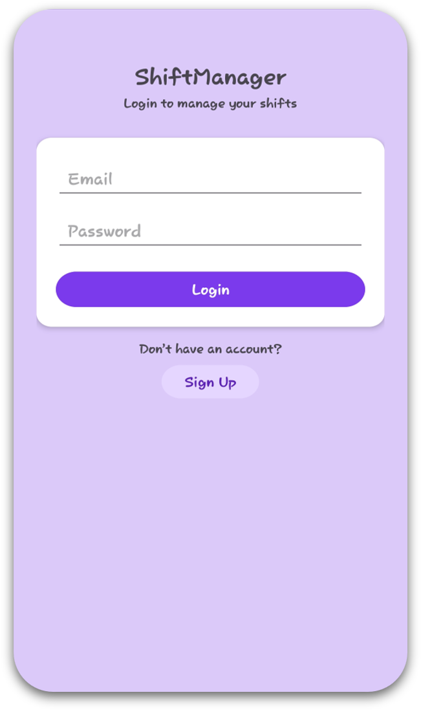
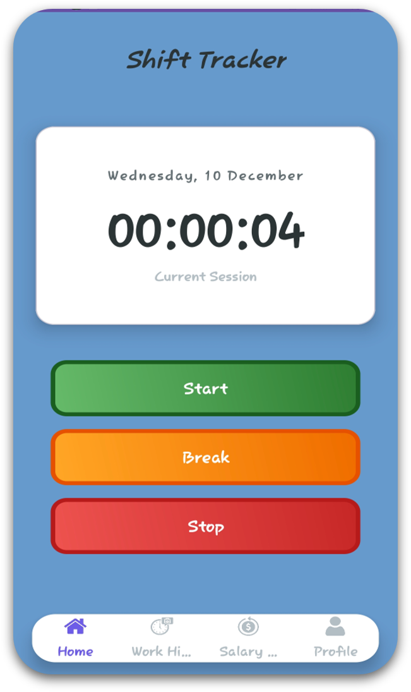
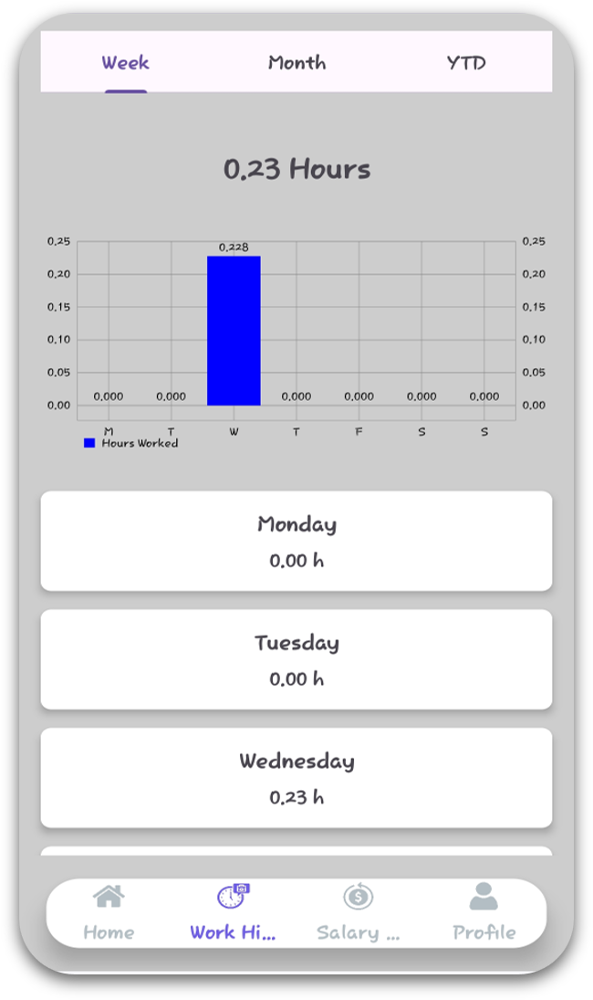

# ShiftMate: The Digital Logbook for Hourly Workers

> **ShiftMate** is a native Android application designed to help hourly employees accurately track work hours, estimate real-time earnings, and manage weekly shift limits.

---

## 📱 Project Overview
Manual time tracking is error-prone and often leads to payroll discrepancies. **ShiftMate** solves this by providing a "set and forget" digital solution. It features a robust background timer, real-time salary calculation, and local data persistence to ensure workers have verifiable data regarding their labor.

**Key Objective:** To demonstrate the implementation of Android Foreground Services, local JSON serialization, and complex state management in a user-friendly utility app.

## ✨ Key Features

### ⏱️ Real-Time Shift Tracking
- **Precision Timer:** Start, Break, Resume, and Stop functionality.
- **Background Persistence:** Uses **Android Foreground Services** to keep the timer running accurately even if the app is closed or the phone is locked.
- **Notification Controls:** Manage the timer directly from the notification shade.

### 💰 Live Salary Calculator
- **Dynamic Earnings:** Calculates gross salary in real-time as the timer runs, based on the user's specific hourly wage.
- **Visual Feedback:** See exactly how much money has been earned at any specific moment during a shift.

### 🔔 Intelligent Alerts
- **Burnout Prevention:** Proactive notifications alert the user when they are approaching their self-set weekly hour limits (e.g., alerts at 5 hours remaining).
- **Logic:** Background BroadcastReceivers monitor total weekly hours against user constraints.

### 📊 Comprehensive History
- **Data Logging:** Detailed logs of every shift (Start Time, End Time, Duration, Earnings).
- **Views:** Categorized history tabs for **Weekly**, **Monthly**, and **Year-to-Date** summaries.

---

## 🛠️ Tech Stack & Architecture

* **Language:** Java (Native Android)
* **IDE:** Android Studio
* **UI:** XML Layouts (ConstraintLayout, RecyclerView)
* **Storage:** * `SharedPreferences` (User Auth, Session Management, Profile Settings)
    * `JSON Serialization` (Complex Shift History Objects)
* **Background Tasks:** Foreground Services, BroadcastReceivers

### Technical Highlight: The Persistence Problem
One of the biggest challenges in this project was ensuring the timer did not reset when the Android OS cleared memory.
* **Solution:** We implemented a `TimerService` that runs as a **Foreground Service**. This gives the process higher priority within the Android OS, ensuring the timer state and timestamps persist through app restarts.

---

## 📸 Screenshots
| Login Screen | Home Timer | Shift History |
|:---:|:---:|:---:|
|  |  |  |

---

## 🚀 How to Run

1.  **Clone the Repository**
    ```bash
    git clone [https://github.com/ishpan188-boop/Shift_Tracker_App.git](https://github.com/ishpan188-boop/Shift_Tracker_App.git)
    ```
2.  **Open in Android Studio**
    * Open Android Studio -> File -> Open -> Select the cloned folder.
3.  **Sync Gradle**
    * Allow the project to sync dependencies.
4.  **Run Emulator**
    * Select a device (Pixel 6 recommended) and click "Run".

---

## 👤 Authors

* **Ish** - *Lead Developer / UI / Backend Logic*
* **Renil** - *Developer*
* **Mustafa** - *Developer*

---

## 📄 License
This project is open-source and available under the MIT License.
